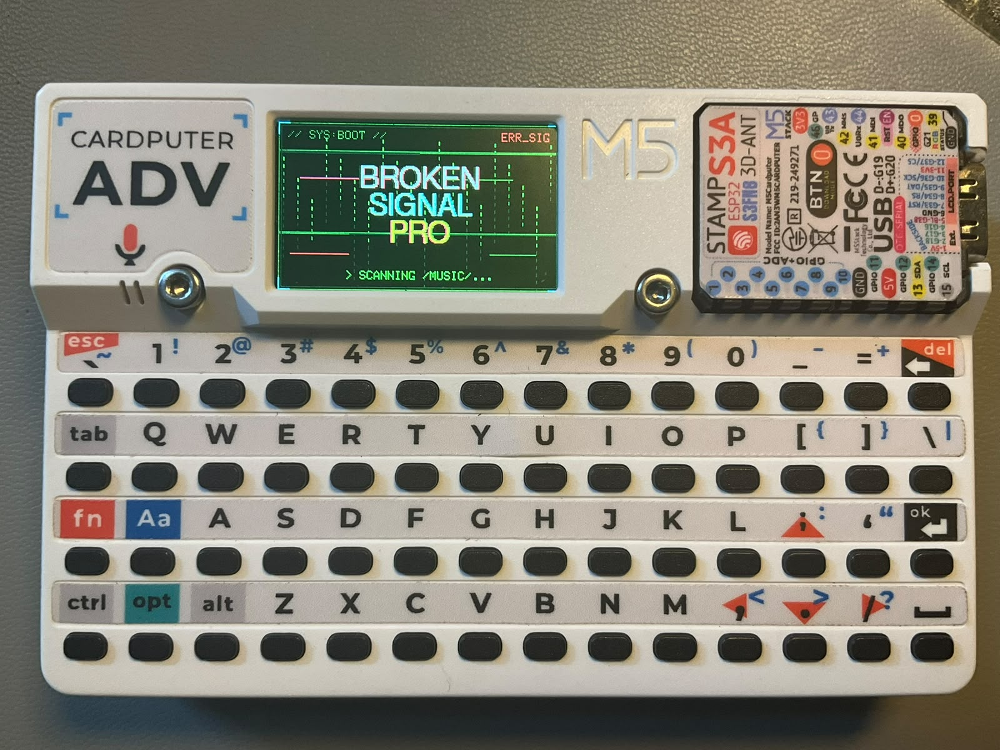

# BrokenSignal Pro - WORK IN PROGRESS

An audio player, web radio, and digital diary for the **Cardputer ADV**.

This project is a fork of the **BrokenSignal-Next** fork by Rythlan.

> ⚠️ **Status:** Work in Progress — core RTC support is implemented. Note taking and calculator features are still under development.



---

## What's New in this Fork

- **RTC Support** — External DS3231 RTC support with NTP synchronization and persistent time across reboots.
- **Clock Display** — Current time is displayed across the main interfaces.
- **Digital Diary / Notes** — Notes can be viewed from the MicroSD card using date-based note files.
- **Partial Redraw** — Notes navigation uses partial screen updates to reduce unnecessary full-screen redraws.
- **Cardputer ADV Support** — Development and UI are specifically targeted at the Cardputer ADV.

---

## Features

- **Help overlay**: Press `H` at any time to open a context-aware help screen for your current mode.

- **MP3 and M4A (AAC-LC) playback**: Plays native iTunes M4A files using a custom MP4 container demuxer, removing the need to convert your library beforehand.

- **Web radio streaming**: Press `W` to jump to radio mode and stream your favorite web stations (MP3/AAC) over WiFi.

- **Digital diary / Notes**: Press `N` to open the Notes application and view notes stored on the MicroSD card.

- **RTC clock**: Uses an external DS3231 RTC module to maintain the system clock across reboots. The clock can also be synchronized through NTP when connected to WiFi.

- **Folder navigation**: Browse nested directories under `/Music/` with lazy-loading directory scans to ensure quick startups.

- **Large folder support**: Automatically paginates folders containing over 200 tracks into pages of 25.

- **Five visual themes**: Switch themes instantly using keys `1` to `5`, applying cohesive styling to both the media player and radio UI.

- **Repeat modes**: Toggle between off, repeat one, or repeat all.

- **Shuffle**: Play back tracks in random order.

- **Recent tracks**: A virtual playlist showing the 10 most recently played tracks.

- **Persistent settings**: Themes, volume levels, repeat preferences, shuffle states, seek steps, power-saving options, brightness, and auto-dim timers are saved automatically to `/Music/settings.cfg`.

- **Screen off**: Turn off display power to conserve battery life while your audio continues playing in the background.

---

## RTC Module

BrokenSignal Pro supports an external **DS3231 RTC module** connected to the Cardputer ADV through I²C.

### Wiring

The RTC module uses the following connections:

| DS3231 RTC | Cardputer ADV |
|------------|---------------|
| VCC | 3.3V |
| GND | GND |
| SDA | GPIO 13 |
| SCL | GPIO 15 |


The firmware initializes the RTC using:

```cpp
#define RTC_SDA 13
#define RTC_SCL 15
````

### RTC Synchronization

The clock can be synchronized through NTP when WiFi is available.

After synchronization, the time is written to the DS3231 RTC so that the clock can be restored after reboot.

---

## Themes

| Key | Name            | Palette                           |
| --- | --------------- | --------------------------------- |
| `1` | Neon Noir       | Magenta + cyan on dark background |
| `2` | Glitch Terminal | Phosphor green CRT, amber accents |
| `3` | Corpo Chrome    | Gold + chrome on dark slate       |
| `4` | Miami Vice      | Hot pink + turquoise on dark navy |
| `5` | Ash             | Monochrome white-on-black         |

---

## Controls

### Music player

| Key       | Action                                          |
| --------- | ----------------------------------------------- |
| `;` / `.` | Cursor up / down                                |
| `ENTER`   | Open folder / Play track / Press again to stop  |
| `DEL`     | Back to parent folder                           |
| `SPACE`   | Pause / Resume / Start playback if idle         |
| `,`       | Rewind (seek back) / Prev page or parent folder |
| `/`       | Forward (seek forward) / Next page              |
| `+` / `=` | Volume up                                       |
| `-`       | Volume down                                     |
| `R`       | Cycle repeat mode (off → one → all)             |
| `S`       | Toggle shuffle                                  |
| `W`       | Switch to web radio mode                        |
| `N`       | Open Notes                                      |
| `O`       | Screen on / off                                 |
| `M`       | Settings menu                                   |
| `D`       | Debug overlay                                   |
| `H`       | Help overlay                                    |
| `1`–`5`   | Switch theme                                    |

### Web radio

| Key               | Action                                      |
| ----------------- | ------------------------------------------- |
| `;` / `.`         | Scroll up / down the station list           |
| `ENTER` / `SPACE` | Play selected station / Press again to stop |
| `A`               | Add station                                 |
| `X`               | Remove selected station                     |
| `6`               | Toggle Force AAC codec                      |
| `R`               | Restart stream connection                   |
| `+` / `=`         | Volume up                                   |
| `-`               | Volume down                                 |
| `W` / `DEL`       | Return to music player                      |
| `M`               | Settings menu                               |
| `D`               | Debug overlay                               |
| `O`               | Screen on / off                             |
| `H`               | Help overlay                                |
| `1`–`5`           | Switch theme                                |

### Notes / Digital Diary

| Key       | Action                                 |
| --------- | -------------------------------------- |
| `;` / `.` | Select previous / next note            |
| `N`       | Open Notes                             |
| `DEL`     | Exit Notes                             |
| `ENTER`   | Edit selected note *(WIP)*             |
| `[` / `]` | Browse previous / next day *(planned)* |

### WiFi overlay

If no saved network credentials are found on startup, a network selector will display automatically.

| Key       | Action              |
| --------- | ------------------- |
| `;` / `.` | Scroll network list |
| `ENTER`   | Select network      |
| `DEL`     | Cancel / dismiss    |

### Settings menu

| Key         | Action           |
| ----------- | ---------------- |
| `;` / `.`   | Navigate options |
| `+` / `-`   | Cycle values     |
| `ENTER`     | Toggle settings  |
| `M` / `DEL` | Exit and save    |

**Settings options:**

| Option          | Values                              |
| --------------- | ----------------------------------- |
| Seek step       | `10s` (default) - adjustable        |
| WiFi power save | ON / OFF                            |
| Brightness      | 0 (off) / 16 / 64 / 128 / 200 / 255 |
| Auto screen off | OFF / 15s / 30s / 60s / 120s        |

---

## TODO

* Replace `DEL` with `ESC` for exiting and canceling where appropriate.
* Implement full note-taking and note-editing functionality.
* Implement calculator.
* Improve Notes date navigation and diary workflow.
* Add Bluetooth functionality.
* Add infrared functionality.

---

## Hardware Requirements

* **Cardputer ADV**
* **DS3231 RTC module**
* **MicroSD card**

---

## SD Card Layout

```text
SD/

├── Music/
│   ├── track.mp3
│   ├── track.m4a
│   ├── settings.cfg
│   ├── _radio/
│   │   ├── webradio.cfg
│   │   └── wifi.cfg
│   └── Album Folder/
│       ├── 01 - Track.mp3
│       └── 02 - Track.m4a
│
└── Notes/
    ├── 2026-08-23.txt
    ├── 2026-08-22.txt
    └── 2026-08-21.txt
```

Notes are stored as plain text files using the `YYYY-MM-DD.txt` naming convention.

The app handles folder trees to any depth. The system skips the `_radio/` configuration directory automatically during regular music scans. All required configuration files are generated by the software; you do not need to create them manually.
## Build via PlatformIO (Recommended)

### Prerequisites

Install [PlatformIO](https://platformio.org/) for your favorite editor (VS Code, CLI, etc.).

### Build and upload
build and flash the device using the integrated PlatformIO extension buttons in your IDE.

### Dependencies

Managed automatically inside `platformio.ini`:

| Library      | Version |
| ------------ | ------- |
| M5Cardputer  | 1.1.1   |
| ESP8266Audio | 2.2.0   |

---

## Radio Streaming Details

### Protocol Support

Supports HTTP and HTTPS streams with MP3 and AAC decoding. A custom stream wrapper (`AudioFileSourceHTTPSStream`) handles both protocols dynamically: it uses `WiFiClient` for standard HTTP streams and `WiFiClientSecure` for HTTPS, helping save valuable RAM overhead on unencrypted streams.

### Stability Tweaks

* **ICY Metadata Filtering**: An `Icy-MetaData: 0` header is sent with outgoing web requests to prevent decoder desynchronization and pops caused by inline song titles.

* **Graceful Reconnects**: If the network buffer empties temporarily, the wrapper returns 0 instead of immediately closing and reopening the TCP connection. This minimizes reconnect loops, reducing screen freezes and stuttering.

* **Proactive Buffering**: The `radioBuf->loop()` function runs inside the `pumpRadioAudio()` iteration to keep the RAM buffer filled in the background, separating network speeds from audio decoding routines and keeping the UI snappy.

* **5-Second Connection Timeout**: Unresponsive radio streams time out after 5 seconds instead of locking up the system indefinitely.

### Force AAC Codec

Some web radio stations serve AAC streams without defining the proper file extension. Press `6` in radio mode to override auto-detection and force all streams to be decoded as AAC instead of MP3.

---

## Technical Notes

* **M4A Playback**: The player utilizes a custom MP4 container demuxer (`AudioFileSourceM4A`) that parses the `moov` atom tree, extracts sample tables, and feeds audio frames with pre-pended ADTS headers directly to `AudioGeneratorAAC`. File durations are calculated starting from the end of the file to bypass long, sequential FAT chain walks over large `mdat` data blocks.

* **Custom HTTPS Stream**: `AudioFileSourceHTTPSStream` extends the standard `AudioFileSource` to support dynamic client allocation, ICY metadata filtering, and optimized reconnection behavior. It replaces the stock HTTP stream wrapper to provide uniform stability fixes.

---

## License

This project is licensed under the `MIT License`.

---

## Credits

* Original codebase: [MarcoRR / BrokenSignal](https://github.com/MarcoRR/BrokenSignal)
* Underlying audio engine: [earlephilhower / ESP8266Audio](https://github.com/earlephilhower/ESP8266Audio/tree/master)

```
```
