# BrokenSignal Pro

An audio player, web radio, quick notes, and utility shell for the **Cardputer ADV**.

**Pro stands for Productivity**: fast access to music, radio, notes,
calculations, and everyday utilities from one keyboard-driven interface.

**Current release:** `v1.4.0`

**Latest tagged release:** `v1.4.0`

BrokenSignal Pro is a fork of the **BrokenSignal-Next** fork by Rythlan, rebuilt around a compact Glitch Terminal UI for small-screen daily use.

<p align="center">
  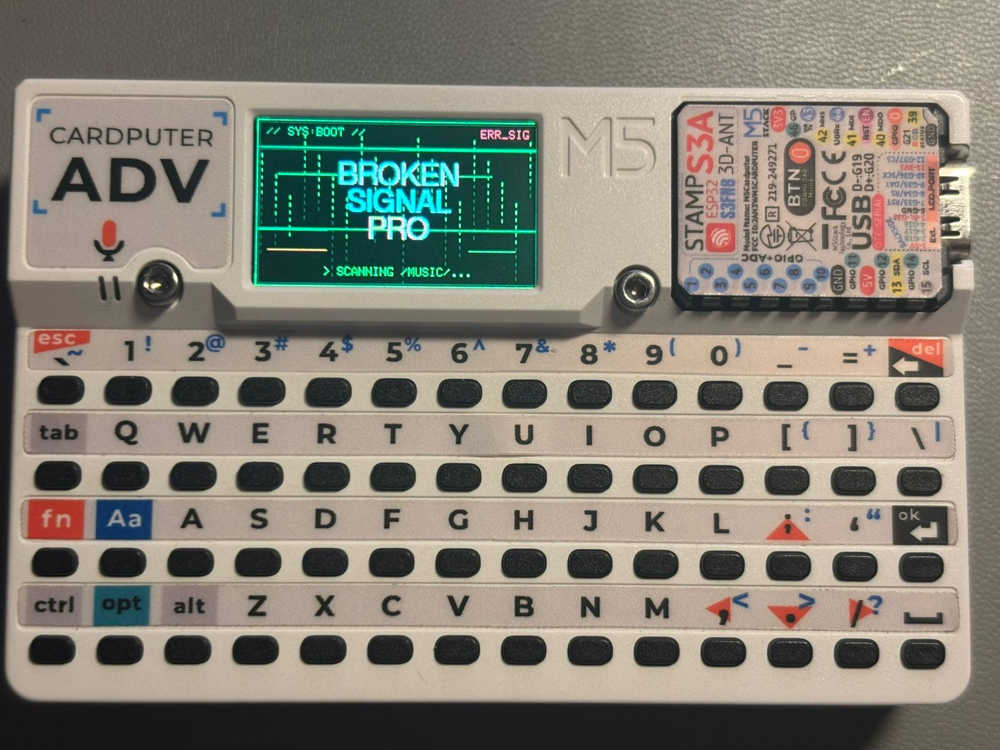
</p>

## Current Status

BrokenSignal Pro `v1.4.0` is organized as a small embedded shell runtime. A
foreground app runs under shared Applications, Options, Control Panel, Help,
Debug, quick-access, and modal surface layers.

The main UI is built from reusable primitives:

- `Header`
- `List`
- `Footer`
- `Overlay`
- `Toast`

Themes change color and mood, not layout. Music Player, Web Radio, Notes,
Calculator, Control Panel, Help, Debug, and WiFi share the same UI primitives
and keyboard routing rules.

## v1.4.0 Release Highlights

- Added the Expense Tracker with quick entry, date navigation, editing, moving,
  deletion, default currency selection, and QR sharing.
- Added stable expense IDs and local processed-state display for safe retries.
- Added authenticated local WiFi upload from the Cardputer to the PC companion.
- Added a PC companion that parses and validates expenses, uses Codex to
  normalize titles and categories, and keeps duplicate/retry state in SQLite.
- Added optional Notion page creation with locally generated, Git-ignored
  configuration and an optional Account relation.
- Added a `T` shortcut that shows the displayed day's currency-aware total.
- Added automatic saved-network reconnection before expense upload, with WiFi
  selection fallback and automatic upload resume after connection.

## Gallery

<p align="center">
  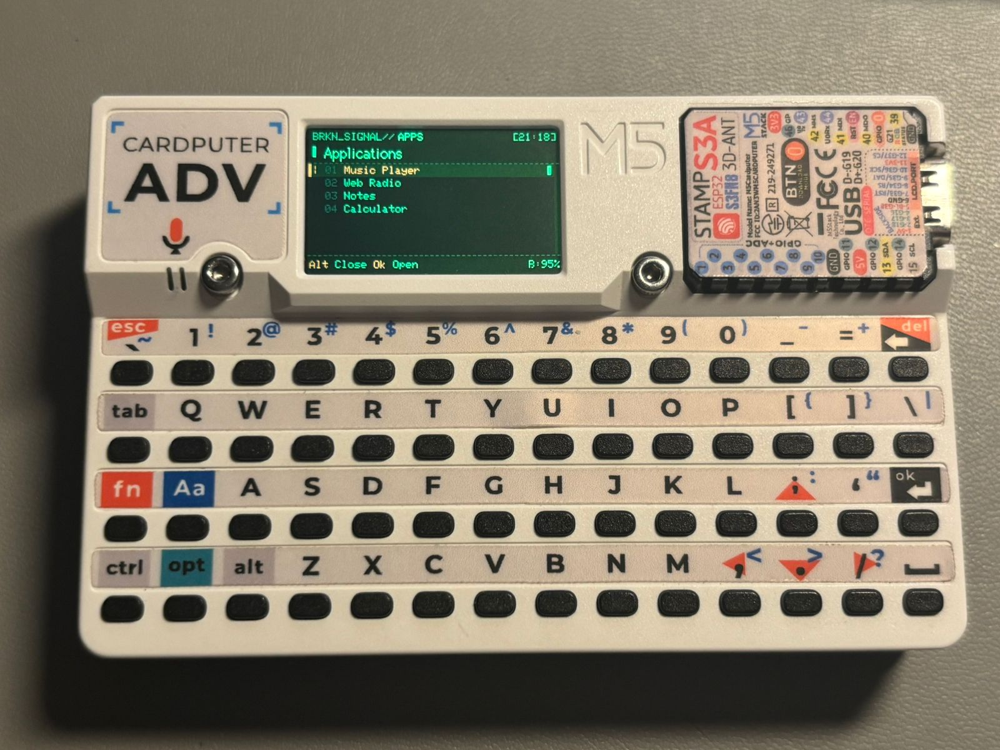
  <br>
  <strong>Applications</strong>
</p>

<p align="center">
  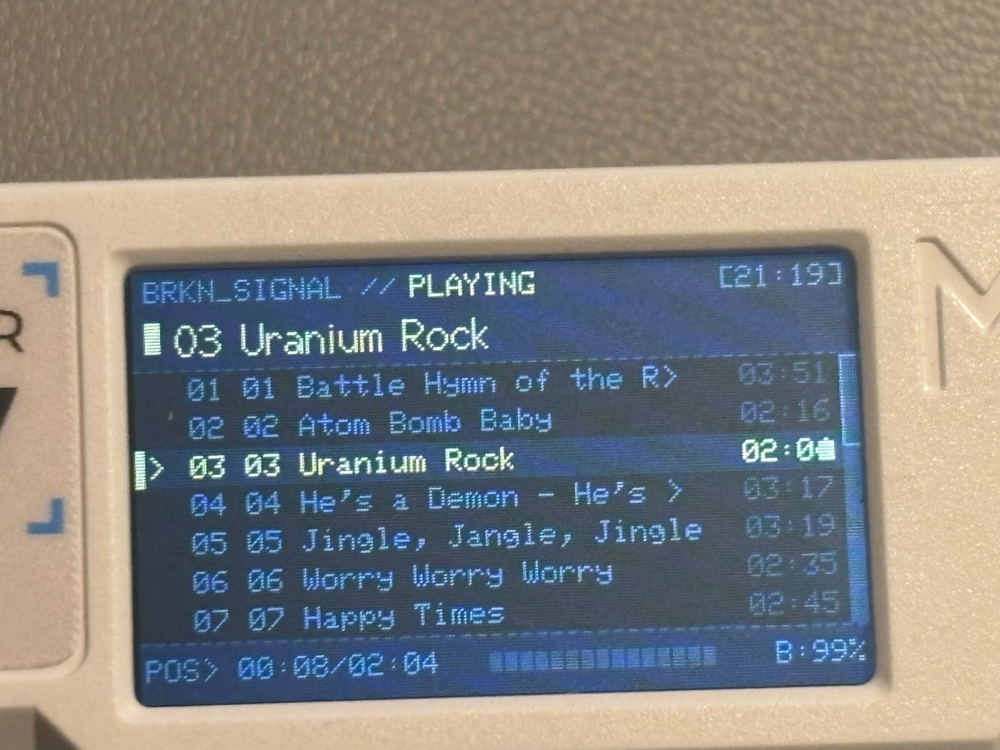
  <br>
  <strong>Music Player</strong>
</p>

<p align="center">
  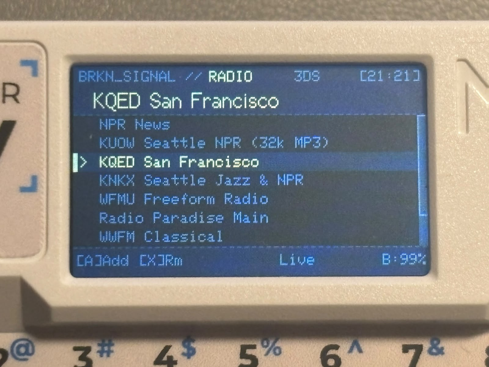
  <br>
  <strong>Web Radio</strong>
</p>

<p align="center">
  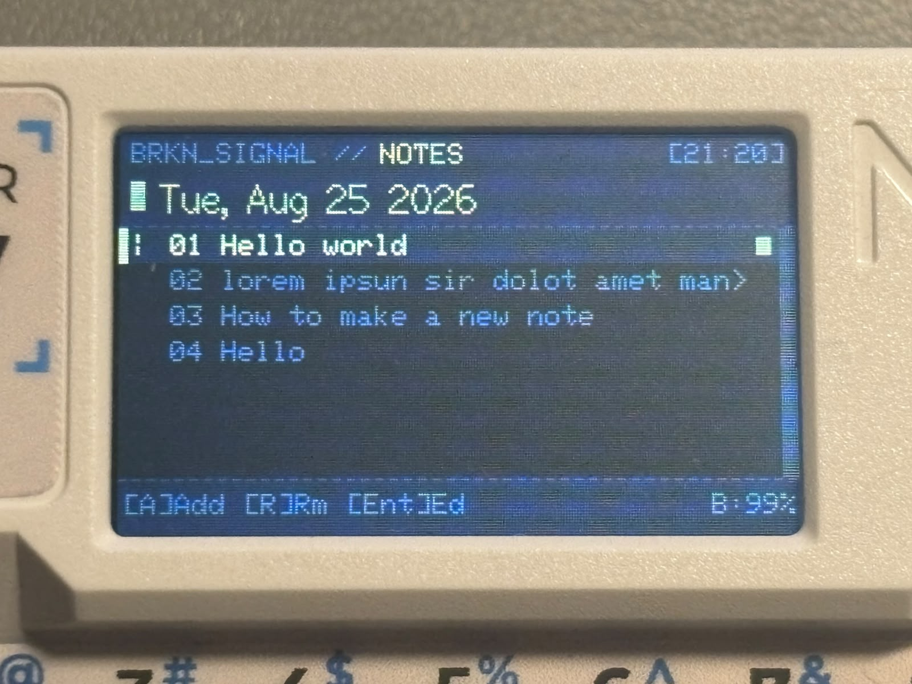
  <br>
  <strong>Notes</strong>
</p>

<p align="center">
  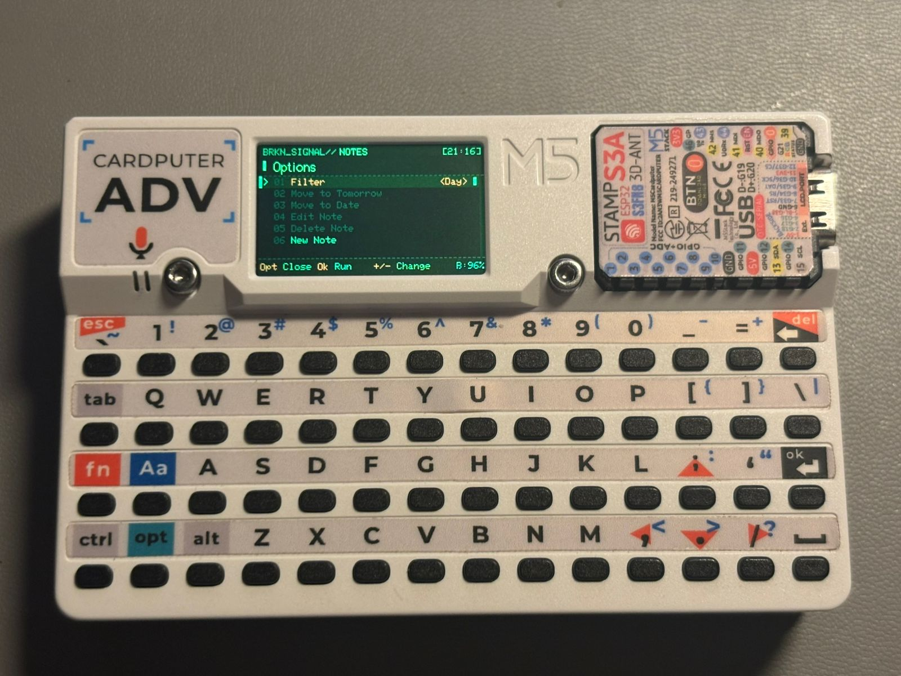
  <br>
  <strong>Contextual Options</strong>
</p>

<p align="center">
  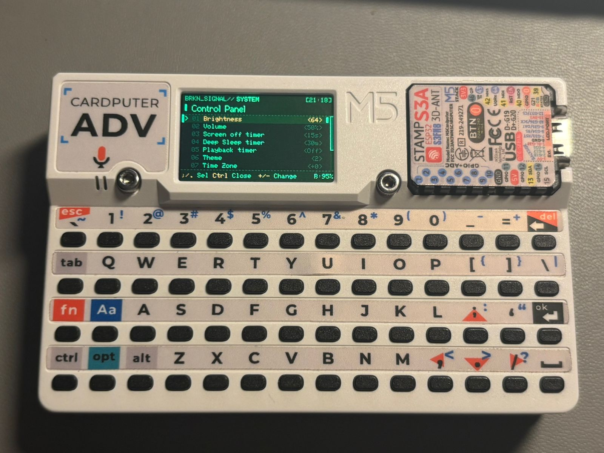
  <br>
  <strong>Control Panel</strong>
</p>

<p align="center">
  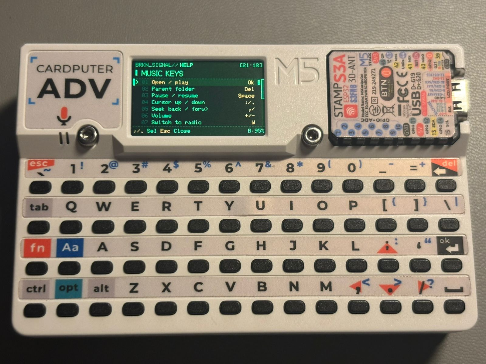
  <br>
  <strong>Context Help</strong>
</p>

<p align="center">
  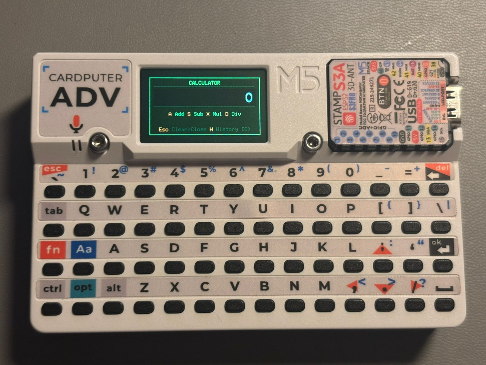
  <br>
  <strong>Calculator</strong>
</p>

<p align="center">
  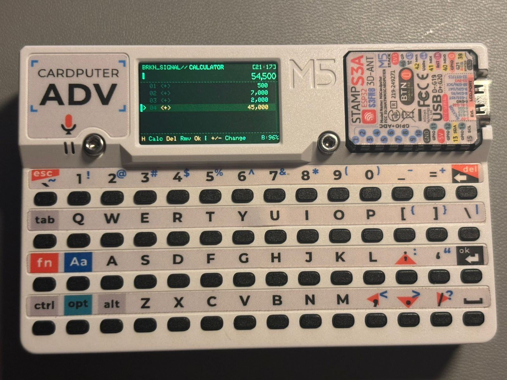
  <br>
  <strong>Calculation History</strong>
</p>

## Features

- **Music playback**: MP3 and M4A/AAC-LC playback from MicroSD.
- **Web radio**: Stream MP3/AAC stations over WiFi.
- **Background audio**: Music or radio can keep playing while opening Settings, Notes, Help, WiFi, Debug, or Calculator.
- **Notes**: Monthly note storage with quick note overlay, day/month filtering, and done-state dimming.
- **Applications**: `Alt` opens the generated application list, including the Thermal Printer client.
- **Registry-driven quick access**: Apps can publish one overlay shortcut without changing every host app.
- **Contextual Options**: `Opt` opens settings and actions belonging to the active application.
- **Context-aware Help**: `H` opens Help for the active full-screen application.
- **Calculator**: `C` opens its quick overlay and `F` expands it to the full app.
- **Expense Tracker**: `E` opens a quick expense entry overlay from any other full-screen app.
- **RTC clock**: DS3231 RTC support with optional NTP sync.
- **WiFi service UI**: WiFi menu is handled by the WiFi service and accessible from Settings.
- **Granular redraw**: Header, list rows, footer slots, progress bar, and overlay input can update independently.
- **Themes**: Five visual themes with persistent settings.
- **Toast primitive**: Small transient popups, currently used for theme name feedback.
- **Power saving**: Brightness setting, screen-off control, and auto screen-off timer.
- **Bluetooth keyboard**: Pair and retain up to three encrypted host bonds, then
  use the Cardputer keyboard as a BLE HID keyboard. `BtnG0` safely releases all
  keys and disconnects the active typing session. Shared controller, security,
  bonding, and HID transport live in the Bluetooth service for reuse by future
  apps.
- **Thermal printer**: Compose and queue text jobs through the ESP32-C3 printer's
  versioned HTTP API, with label/continuous media settings and paper actions.

## UI Architecture

BrokenSignal Pro is structured as an embedded shell/app runtime:

```text
+---------------------+     +---------------------+
| Shell surfaces      |     | Host apps           |
| Apps / Options      |     | Music / Radio       |
| Control / Help      |     | Notes / Calculator  |
+----------+----------+     +----------+----------+
           |                           |
           +------------+--------------+
                        |
           +------------v--------------+
           | Core runtime              |
           | State / System            |
           | AppRuntime / Registry     |
           | SurfaceManager / Keyboard |
           +------------+--------------+
                        |
+----------v----------+     +----------v----------+
| UI primitives       |     | Shared services     |
| Header/List/Footer  |     | FileBrowser/WiFi/BLE|
| Overlay/Toast       |     | Clock/Audio         |
+----------+----------+     +----------+----------+
           |                           |
           +------------+--------------+
                        |
           +------------v--------------+
           | Platform, hardware, SD    |
           +---------------------------+
```

The production UI is built from reusable primitives:

```text
Screen
|-- Header
|-- List
|-- Footer
|-- Overlay / Toast
```

The default layout is Glitch Terminal:

```text
+------------------------------------------+
| Header: app tag, title, WiFi, clock      |
+------------------------------------------+
| List: selected row, values, scrollbar    |
+------------------------------------------+
| Footer: navigation hints          B:95%  |
+------------------------------------------+
```

Footer convention:

```text
Left slot / key hints               Battery
```

Keep key hints in the left slot so they can use the widest predictable space.
The center slot is reserved for status text or a segmented progress bar.

Application-facing code is organized by responsibility:

```text
src/apps/       App-owned lifecycle, input, metadata, views, and storage
src/core/       App registry/runtime, surface routing, state, and system flow
src/UI/         Header, List, Footer, Overlay, Toast, and Themes
src/module/
|-- shell/      Applications, Options, Control Panel, Help, and Debug
`-- service/    Bluetooth, Clock, WiFi, and File Browser
```

See [Architecture](docs/ARCHITECTURE.md) for the firmware layer map and input
ownership model. See [Vocabulary](docs/VOCABULARY.md) for project terms, and
[App Development](docs/APP_DEVELOPMENT.md) for the host-app API, registration
checklist, and compile-safe example templates.

Apps are discovered from `src/apps/*/app.json` during the PlatformIO pre-build
step. A third-party host app can be installed as one self-contained folder
without editing core, shell, keyboard, or existing app sources.

## Controls

### Bluetooth Keyboard

Open Bluetooth Keyboard from Applications. Select a stored device or `Pair New
PC`, then press `Ok`. Paired PCs can be given persistent friendly names from
the Options menu. While the connection overlay is open, all matrix keys
belong to the remote host and global firmware shortcuts are blocked.

| Key | Action |
| --- | ------ |
| `;` / `.` | Select paired device |
| `Ok` | Connect or start pairing |
| `Opt` | Rename or forget selected/all pairings |
| `BtnG0` | Release all keys, disconnect, and close typing mode |
| `Fn` + `` ` `` | Send Escape |
| `Fn` + `;` / `.` | Send Up / Down |
| `Fn` + `,` / `/` | Send Left / Right |

### Global Host Shortcuts

| Key | Action |
| --- | ------ |
| `H` | Context help |
| `Opt` | Toggle contextual Options |
| `Alt` | Toggle Applications |
| `Ctrl` | Toggle Control Panel |
| `C` | Calculator |
| `N` | Quick note |
| `O` | Screen on / off |
| `[` / `]` | Brightness down / up |

Global host shortcuts are ignored by modal text inputs and confirmation overlays.
If a foreground app reserves the same letter, the app-specific meaning wins.

List-style property rows use `,` / `/` as left / right adjustment keys. This
keeps `-` and `+` available for playback volume muscle memory in host
apps where those keys do not have a stronger local meaning.

Music, Radio, full-screen Notes, and Calculator history support playback volume
with `-` / `+`. Volume and brightness changes are shown as transient header
feedback, for example `VOL 50%` or `BRI 78%`.

`Alt`, `Opt`, and `Ctrl` can switch directly between Applications, Options, and
Control Panel. Modal editors and confirmations keep input until closed.

### Music

| Key | Action |
| --- | ------ |
| `;` / `.` | Cursor up / down |
| `Ok` | Open folder / play selected track |
| `SPACE` | Pause / resume |
| `DEL` | Parent folder |
| `,` / `/` | Seek back / forward |
| `-` / `+` | Volume down / up |
| `R` | Cycle repeat mode |
| `S` | Toggle shuffle |
| `W` | Switch to Radio |

### Radio

| Key | Action |
| --- | ------ |
| `;` / `.` | Cursor up / down |
| `Ok` / `SPACE` | Play / stop stream |
| `A` | Add station |
| `X` | Remove station |
| `R` | Reconnect |
| `I` | Force AAC |
| `-` / `+` | Volume down / up |
| `W` | Back to Music |

### Notes

| Key | Action |
| --- | ------ |
| `A` | Add note |
| `R` | Remove note |
| `X` | Toggle done |
| `Ok` | Edit selected note |
| `;` / `.` | Cursor up / down |
| `,` / `/` | Previous / next date |
| `-` / `+` | Volume down / up |
| `Opt` then `,` / `/` | Change Day/Month filter |
| `T` | Today |
| `U` / `B` | Top / bottom |
| `Esc` | Back |

Notes use monthly files under `/Notes/`.

In the note editor, `Tab` switches between note text and date. `Fn+Up/Down`
changes the date, while `Fn+Left/Right` moves the active field cursor.

### Expense Tracker

Press `E` from another full-screen app to open quick expense entry. The full
Expenses app provides date navigation, editing, QR sharing, and authenticated
upload to the PC companion.

| Key | Action |
| --- | ------ |
| `A` | Add expense |
| `R` | Remove selected expense |
| `T` | Show the displayed day's total as a toast |
| `X` | Toggle the selected expense's shared/processed display state |
| `Ok` | Edit selected expense |
| `;` / `.` | Cursor up / down |
| `,` / `/` | Previous / next date |
| `Opt` | Open expense actions |

Expense Options include moving an entry, editing/deleting it, syncing all
unmarked entries for the displayed day to the PC, sharing the day's entries as QR pages, and changing
the default currency. Upload automatically opens the WiFi connection flow when
the Cardputer is offline and resumes after a successful connection.

### Thermal Printer

Open Thermal Printer from Applications. The Cardputer and ESP32-C3 printer must
be on the same WiFi network. The default server is
`http://thermal-printer.local`; set `Printer URL` in Options to an explicit
`http://<ip-address>` if mDNS is unavailable. Layout and server settings are
saved to `/Printer/settings.cfg` on the SD card. Draft print text remains only
in memory.

| Key | Action |
| --- | ------ |
| `Ok` | Edit print text |
| `P` | Queue the text job |
| `S` | Read busy/queue/completed status |
| `F` | Feed the configured number of lines |
| `G` | Advance label media to the next gap |
| `T` | Queue the printer test page |
| `Fn` + `Ok` | Insert a newline while editing |
| `Opt` | Open layout, server, and printer actions |

The app uses API version 1 from the ESP32-C3 Thermal Printer Interface. A
successful print response means the job was accepted into the printer queue;
use `S` to check whether it has completed. Text jobs are limited to 2048 bytes.
Image and PDF raster printing remains available from the printer's browser UI.

### WiFi

WiFi is available from Settings.

| Key | Action |
| --- | ------ |
| `R` | Refresh scan |
| `;` / `.` | Cursor up / down |
| `Ok` | Connect |
| `Esc` / `DEL` | Back / cancel |

### Control Panel

| Key | Action |
| --- | ------ |
| `;` / `.` | Select setting |
| `,` / `/` | Change value |
| `Ok` | Apply / open selected setting |
| `Ctrl` / `Esc` | Close and save |

Settings include:

| Option | Notes |
| ------ | ----- |
| Brightness | Display brightness |
| Volume | System playback volume |
| Screen off timer | Idle screen timeout |
| Deep Sleep timer | Idle deep-sleep timeout |
| Playback timer | Stop playback after a selected interval |
| Theme | Active color theme |
| Time Zone | UTC offset |
| Sync Clock | NTP sync when WiFi is available |
| Manual Clock | Time and date editor |
| WiFi power save | Toggle WiFi modem sleep |
| Debug | Runtime diagnostics |
| WiFi menu | Opens WiFi service menu |

### Calculator

| Key | Action |
| --- | ------ |
| `0` to `9` / `.` | Enter number |
| `A` / `+` | Add |
| `S` / `-` | Subtract |
| `X` / `*` | Multiply |
| `D` / `/` | Divide |
| `Ok` | Calculate |
| `DEL` | Backspace |
| `Esc` | Close top surface / Applications |
| `F` | Open full-screen calculation history |
| `H` | Toggle Calculator Help |
| `Opt` | Toggle Calculator Options |
| `[` / `]` | Brightness down / up |
| `C` | Close |

Calculator history uses `A`, `S`, `M`, and `D` to append addition,
subtraction, multiplication, and division rows. `,` / `/` changes the selected
history row operator, `-` / `+` changes volume, and `I` inserts a row above the
current selection. Calculator entry keeps `+`, `-`, and `/` for arithmetic.
Calculator Options control decimal places, rounding mode, and thousands
separators.

## Themes

Available themes:

| Name |
| --- |
| Neon Noir |
| Glitch Terminal |
| Corpo Chrome |
| Miami Vice |
| Ash |

Theme selection and the optional Alt/Opt shell-function swap are available from
Control Panel and saved to `/Music/settings.cfg`.

## RTC Module

BrokenSignal Pro supports an external **DS3231 RTC module** connected through I2C.

| DS3231 RTC | Cardputer ADV |
| ---------- | ------------- |
| VCC | 3.3V |
| GND | GND |
| SDA | GPIO 13 |
| SCL | GPIO 15 |

<p align="center">
  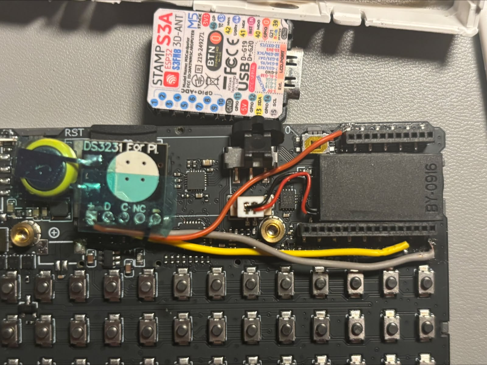
</p>

The firmware uses:

```cpp
#define RTC_SDA 13
#define RTC_SCL 15
```

### RTC and GPS Wiring Note

The DS3231 wiring above uses GPIO 13 and GPIO 15 for I2C. If your build also
adds a GPS module, do not assume it can share the same connector or pins.

- I2C RTC modules can share an I2C bus only with other I2C devices that use
  unique addresses and compatible voltage levels.
- Most GPS modules use UART serial instead of I2C, so they need their own RX/TX
  wiring or a deliberately chosen alternate port.
- If a GPS module is already connected to GPIO 13/15, move either the GPS or RTC
  wiring before enabling both modules.
- This firmware currently prioritizes the RTC for instant offline clock restore;
  GPS time can be added later as a separate time source if the hardware wiring
  leaves a safe serial path.

## SD Card Layout

```text
SD/
|-- Music/
|   |-- settings.cfg
|   |-- track.mp3
|   |-- track.m4a
|   |-- _radio/
|   |   |-- webradio.cfg
|   |   `-- wifi.cfg
|   `-- Album Folder/
|       |-- 01 - Track.mp3
|       `-- 02 - Track.m4a
|
|-- Notes/
|   |-- 2026-08.txt
|   |-- 2026-09.txt
|   `-- 2026-10.txt
|
`-- Expenses/
    |-- settings.cfg
    |-- sync.cfg
    |-- 2026-08.txt
    `-- 2026-09.txt
```

Notes are stored per month. Each note line is stored as:

```text
YYYY-MM-DD|-|note text
YYYY-MM-DD|x|done note text
```

`-` means active, `x` means done.

Expenses are stored per month. Current rows include a stable entry ID:

```text
YYYY-MM-DD|-|stable-entry-id|name|amount|currency
```

Older five-field rows are migrated automatically when their month is opened.
`/Expenses/sync.cfg` contains only the PC bridge address and Cardputer shared
token; Notion credentials always remain on the PC.

## Build

Build and upload with PlatformIO.

The active tested environment is:

```bash
platformio run -e cardputeradv
```

Dependencies are managed by `platformio.ini`.

## PC Expense Companion

The isolated [`companion/`](companion/README.md) project accepts pasted QR
payloads and authenticated Cardputer uploads over trusted local Wi-Fi. It uses
Codex to normalize titles/categories, keeps duplicate and retry state in
SQLite, supports safe dry-run modes, and can create one Notion page per expense.

Windows setup:

```powershell
cd companion
.\configure-notion.bat
.\start-expense-server.bat
```

The main BAT currently enables LAN and real Notion submission. Use
`.\start-expense-server.ps1 -Lan` for a Codex-powered dry run. See the companion
guide before enabling sync; every user must supply their own Notion token and
expense database ID. A related Account page ID is needed only when their schema
uses that relation; leave the setup prompt blank otherwise.

## Hardware Requirements

- Cardputer ADV
- MicroSD card
- Optional DS3231 RTC module

## Roadmap

- Add infrared module.
- Add Bluetooth functionality.
- Prototype ESP-NOW daily note send to ESP32-C3 e-ink devices such as Xteink X3.
- Continue removing legacy UI code.
- Further tune overlay and keyboard input behavior on-device.

## Credits

- Original codebase: [MarcoRR / BrokenSignal](https://github.com/MarcoRR/BrokenSignal)
- BrokenSignal-Next fork by Rythlan (https://github.com/Rythlan/BrokenSignal-Next)
- Audio engine: [earlephilhower / ESP8266Audio](https://github.com/earlephilhower/ESP8266Audio)

## License

This project is licensed under the MIT License.
