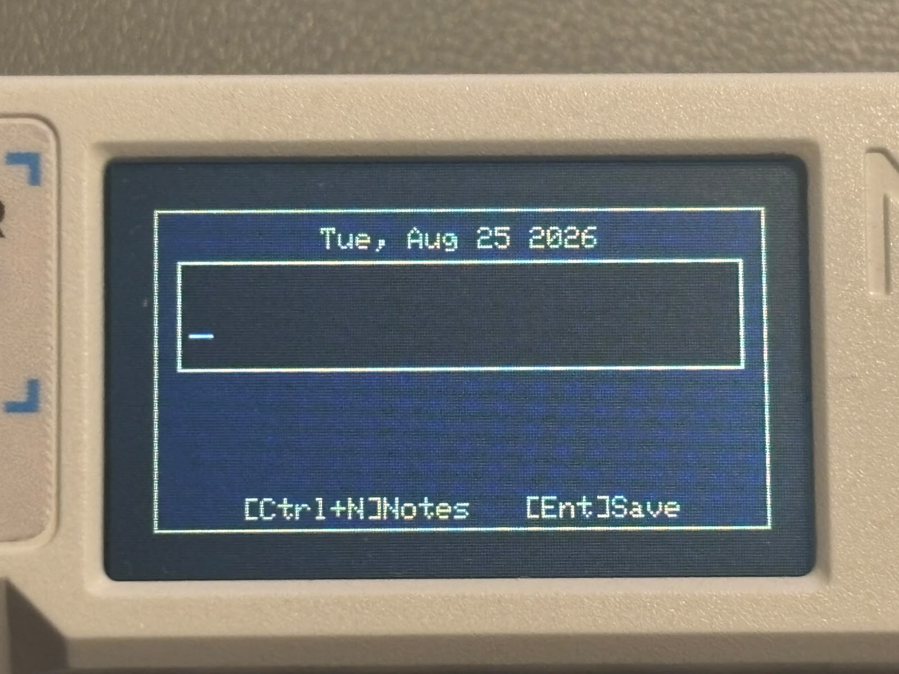

# BrokenSignal Pro

An audio player, web radio, quick notes, and utility shell for the **Cardputer ADV**.

BrokenSignal Pro is a fork of the **BrokenSignal-Next** fork by Rythlan, rebuilt around a compact Glitch Terminal UI for small-screen daily use.

<p align="center">
  
</p>

## Current Status

BrokenSignal Pro is still evolving, but the main UI has moved to a modular primitive architecture:

- `Header`
- `List`
- `Footer`
- `Overlay`
- `Toast`

Themes now change color and mood, not layout. Music, Radio, Notes, Settings, Help, Debug, WiFi, and Calculator are being aligned around the same UI primitives.

## Recent Fixes

- Notes now use a compact `Date|State|Text` line format, with `-` for active items and `x` for done items.
- Notes are filtered by day by default, with `D` for day, `M` for month, `T` for today, and `U` / `B` for top and bottom.
- Overlay and calculator spacing have been tightened up for clearer alignment on the Cardputer screen.
- Calculator input now supports backspace cleanup and a centered helper line below the input field.

## Gallery

<p align="center">
  
  <br>
  <strong>Music Player</strong>
</p>

<p align="center">
  
  <br>
  <strong>Web Radio</strong>
</p>

<p align="center">
  
  <br>
  <strong>Notes</strong>
</p>

<p align="center">
  
  <br>
  <strong>Quick Note Overlay</strong>
</p>

<p align="center">
  
  <br>
  <strong>Context Help</strong>
</p>

<p align="center">
  
  <br>
  <strong>Calculator</strong>
</p>

## Features

- **Music playback**: MP3 and M4A/AAC-LC playback from MicroSD.
- **Web radio**: Stream MP3/AAC stations over WiFi.
- **Background audio**: Music or radio can keep playing while opening Settings, Notes, Help, WiFi, Debug, or Calculator.
- **Notes**: Monthly note storage with quick note overlay, day/month filtering, and done-state dimming.
- **Context-aware Help**: `H` opens help for the current mode.
- **Calculator**: `C` opens a calculator overlay.
- **RTC clock**: DS3231 RTC support with optional NTP sync.
- **WiFi service UI**: WiFi menu is handled by the WiFi service and accessible from Settings.
- **Granular redraw**: Header, list rows, footer slots, progress bar, and overlay input can update independently.
- **Themes**: Five visual themes with persistent settings.
- **Toast primitive**: Small transient popups, currently used for theme name feedback.
- **Power saving**: Brightness setting, screen-off control, and auto screen-off timer.

## UI Architecture

The production UI is built from reusable primitives:

```text
Screen
|-- Header
|-- List
|-- Footer
|-- Overlay / Toast
```

The default layout is Glitch Terminal:

```text
+------------------------------------------+
| Header: app mode, title, WiFi, clock     |
+------------------------------------------+
| List: selected row, values, scrollbar    |
+------------------------------------------+
| Footer: navigation hints          B:95%  |
+------------------------------------------+
```

Footer convention:

```text
Left slot / navigation hints        Battery
```

Music can replace the footer center area with a segmented progress bar.

## Controls

### Global

| Key | Action |
| --- | ------ |
| `H` | Context help |
| `Alt` | Applications |
| `Ctrl` | Control Panel |
| `C` | Calculator |
| `N` | Quick note |
| `Fn+N` | Notes app |
| `D` | Debug |
| `O` | Screen on / off |
| `1` to `5` | Switch theme |
| `+` / `-` | Volume up / down |

Volume changes are shown as a transient header message, for example `VOL 50%`.

### Music

| Key | Action |
| --- | ------ |
| `;` / `.` | Cursor up / down |
| `ENTER` | Open folder / play selected track |
| `SPACE` | Pause / resume |
| `DEL` | Parent folder |
| `,` / `/` | Seek back / forward |
| `W` | Switch to Radio |

### Radio

| Key | Action |
| --- | ------ |
| `;` / `.` | Cursor up / down |
| `ENTER` / `SPACE` | Play / stop stream |
| `A` | Add station |
| `X` | Remove station |
| `R` | Reconnect |
| `I` | Force AAC |
| `W` / `Esc` | Back to Music |

### Notes

| Key | Action |
| --- | ------ |
| `A` | Add note |
| `R` | Remove note |
| `X` | Toggle done |
| `ENTER` | Edit selected note |
| `;` / `.` | Cursor up / down |
| `,` / `/` | Previous / next date |
| `D` | Day view |
| `M` | Month view |
| `T` | Today |
| `U` / `B` | Top / bottom |
| `Esc` | Back |
| `N` | Close Notes |

Notes use monthly files under `/Notes/`.

### WiFi

WiFi is available from Settings.

| Key | Action |
| --- | ------ |
| `R` | Refresh scan |
| `;` / `.` | Cursor up / down |
| `ENTER` | Connect |
| `Esc` / `DEL` | Back / cancel |

### Control Panel

| Key | Action |
| --- | ------ |
| `;` / `.` | Select setting |
| `+` / `-` | Change value |
| `ENTER` | Apply / open selected setting |
| `Opt` / `Esc` / `DEL` | Close and save |

Settings include:

| Option | Notes |
| ------ | ----- |
| Seek step | Music seek interval |
| WiFi power save | Toggle WiFi modem sleep |
| Brightness | Display brightness |
| Auto screen off | Idle screen timeout |
| Sync clock | NTP sync when WiFi is available |
| Timezone | UTC offset |
| Manual clock | Text input date/time |
| WiFi menu | Opens WiFi service menu |

### Calculator

| Key | Action |
| --- | ------ |
| `0` to `9` / `.` | Enter number |
| `A` / `+` | Add |
| `S` / `-` | Subtract |
| `X` / `*` | Multiply |
| `D` / `/` | Divide |
| `ENTER` | Calculate |
| `DEL` | Backspace |
| `Esc` | Clear / close |
| `C` | Close |

## Themes

| Key | Name |
| --- | ---- |
| `1` | Neon Noir |
| `2` | Glitch Terminal |
| `3` | Corpo Chrome |
| `4` | Miami Vice |
| `5` | Ash |

Theme selection is saved to `/Music/settings.cfg`.

## RTC Module

BrokenSignal Pro supports an external **DS3231 RTC module** connected through I2C.

| DS3231 RTC | Cardputer ADV |
| ---------- | ------------- |
| VCC | 3.3V |
| GND | GND |
| SDA | GPIO 13 |
| SCL | GPIO 15 |

<p align="center">
  
</p>

The firmware uses:

```cpp
#define RTC_SDA 13
#define RTC_SCL 15
```

## SD Card Layout

```text
SD/
|-- Music/
|   |-- settings.cfg
|   |-- track.mp3
|   |-- track.m4a
|   |-- _radio/
|   |   |-- webradio.cfg
|   |   `-- wifi.cfg
|   `-- Album Folder/
|       |-- 01 - Track.mp3
|       `-- 02 - Track.m4a
|
`-- Notes/
    |-- 2026-08.txt
    |-- 2026-09.txt
    `-- 2026-10.txt
```

Notes are stored per month. Each note line is stored as:

```text
YYYY-MM-DD|-|note text
YYYY-MM-DD|x|done note text
```

`-` means active, `x` means done.

## Build

Build and upload with PlatformIO.

The active tested environment is:

```bash
platformio run -e cardputeradv
```

Dependencies are managed by `platformio.ini`.

## Hardware Requirements

- Cardputer ADV
- MicroSD card
- Optional DS3231 RTC module

## Roadmap

- Add infrared module.
- Add Bluetooth functionality.
- Continue removing legacy UI code.
- Further tune overlay and keyboard input behavior on-device.

## Credits

- Original codebase: [MarcoRR / BrokenSignal](https://github.com/MarcoRR/BrokenSignal)
- BrokenSignal-Next fork by Rythlan (https://github.com/Rythlan/BrokenSignal-Next)
- Audio engine: [earlephilhower / ESP8266Audio](https://github.com/earlephilhower/ESP8266Audio)

## License

This project is licensed under the MIT License.
